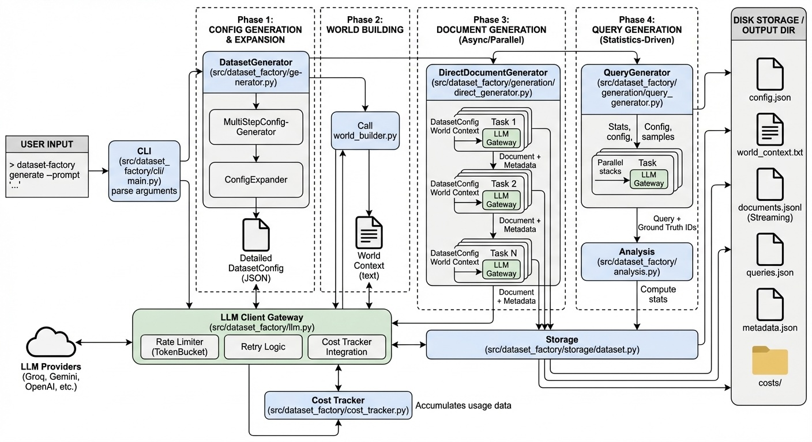

# Dataset Factory

> Generate high-quality RAG evaluation datasets from a single text prompt

[](https://www.python.org/downloads/)
[](https://www.gnu.org/licenses/agpl-3.0)

**Dataset Factory** automatically creates complete RAG (Retrieval-Augmented Generation) evaluation datasets with documents, queries, metadata, and ground truth labels—all from a simple natural language description.



## ✨ Features

- **🚀 One-Command Generation**: Create entire datasets from a single prompt
- **📊 Rich Metadata**: Automatically generates diverse, queryable metadata fields
- **🎯 Ground Truth Labels**: Queries come with relevant document IDs
- **📏 Variable Length Documents**: Generate documents from 400 to 40,000+ tokens with automatic variance
- **💾 Memory Efficient**: Streams documents to JSONL—handles millions of documents
- **⚡ Built-in Rate Limiting**: Smart rate limiting with TPM/RPM tracking, automatic retries, and backoff
- **💰 Real-Time Cost Tracking**: Monitor costs per phase with detailed breakdowns saved to files
- **🔄 Resumable**: Pause and resume generation at any time—tracks progress automatically
- **🎨 Multiple LLM Support**: Works with Gemini, OpenAI, Anthropic, Groq, and more via pydantic-ai
- **📈 Statistics Export**: Automatic dataset statistics with length analysis and selectivity metrics
- **⚙️ Auto-Scaling**: Automatically creates more document types for larger datasets (15-25 types for 1M+ docs)

## 🎯 Quick Start

### Installation

**Using uv (recommended):**

```bash
uv pip install dataset-factory
```

**Or using pip:**

```bash
pip install dataset-factory
```

**Install from source (recommended - lightweight):**

```bash
# Clone WITHOUT example datasets (fast, ~few MB)
GIT_LFS_SKIP_SMUDGE=1 git clone https://github.com/alexjacobs08/dataset-factory.git
cd dataset-factory
uv pip install -e .

# Optional: Download specific example datasets later if needed
git lfs pull --include="datasets/goldrush_1k/*"  # Just the 5 MB dataset
git lfs pull --include="datasets/pharma_5k/*"    # Just the 28 MB dataset

# Or download ALL example datasets (567 MB):
git lfs pull
```

**Alternative: Clone with all example datasets (slower, 567 MB):**

```bash
# Only use this if you need the example datasets immediately
git clone https://github.com/alexjacobs08/dataset-factory.git
cd dataset-factory
uv pip install -e .
```

### Setup

Set your API key by creating a `.env` file:

```bash
# For Groq (recommended - fast and cheap)
GROQ_API_KEY=your_key_here

# Or use other providers
GEMINI_API_KEY=your_key_here
OPENAI_API_KEY=your_key_here
ANTHROPIC_API_KEY=your_key_here
```

### Generate Your First Dataset

```bash
# Single command to generate a complete dataset!
dataset-factory generate \
  --prompt "A gold rush town in the Yukon during the 1890s" \
  --documents 1000 \
  --queries 100 \
  --output output/goldrush
```

**That's it!** You now have a complete RAG evaluation dataset with:
- 1,000 unique documents with realistic content (varied lengths: journals, ledgers, reports)
- 100 queries with metadata filters and ground truth labels
- Rich, queryable metadata (settlements, social roles, economic activities, dates)
- Cost tracking files showing exactly what you spent
- Statistics about your dataset (field cardinalities, length distributions)

## 📦 What You Get

```
output/goldrush/
├── config.json          # Dataset configuration with document types & metadata schema
├── documents.jsonl      # All documents (one per line, streaming format)
├── queries.json         # Queries with filters and ground truth labels
├── metadata.json        # Generation metadata
├── world_context.txt    # Domain context used for generation
├── statistics.json      # Dataset statistics (cardinalities, lengths, selectivity)
└── costs/
    ├── cost_summary.json   # Aggregated costs by phase
    └── cost_batches.jsonl  # Batch-level cost records
```

### Example Document

```json
{
  "id": "doc_00000142",
  "type": "Prospector's Daily Journal Entry",
  "content": "June 15, 1898 - Bonanza Creek\n\nStruck color today! After three weeks of back-breaking labor, the pan finally showed yellow. Not much, mind you - perhaps two pinches worth - but it's there. Moved 40 cubic yards of gravel through the sluice box...",
  "metadata": {
    "settlement_name": "Dawson City",
    "primary_social_role": "Prospector",
    "economic_activity": "Gold Panning",
    "document_date": "1898-06-15",
    "environmental_factors": ["Heavy Snowfall", "River Travel", "Isolation"]
  }
}
```

### Example Query

```json
{
  "id": "query_0023",
  "text": "Find documents about prospectors working on Bonanza Creek during the summer of 1898",
  "filters": {
    "settlement_name": "Dawson City",
    "primary_social_role": "Prospector",
    "economic_activity": "Gold Panning",
    "document_date": "1898-06-01 to 1898-08-31"
  },
  "category": "filtered_search",
  "relevant_doc_ids": ["doc_00000142", "doc_00000389", "doc_00000756"]
}
```

### Example Statistics Output

```json
{
  "document_lengths": {
    "min_length": 268,
    "max_length": 12631,
    "mean_length": 606,
    "median_length": 572,
    "by_document_type": {
      "Mining Claim Registration": {"mean": 454, "range": "268-691"},
      "Prospector's Daily Journal": {"mean": 584, "range": "314-1028"},
      "Merchant's Inventory Ledger": {"mean": 975, "range": "493-12631"}
    }
  },
  "field_cardinalities": {
    "settlement_name": {
      "cardinality": 12, 
      "sample_values": ["Dawson City", "Skagway", "Bonanza Creek", "Whitehorse", ...]
    },
    "primary_social_role": {
      "cardinality": 15, 
      "sample_values": ["Prospector", "Merchant", "Law Enforcement", ...]
    },
    "environmental_factors": {
      "cardinality": 693,
      "sample_values": ["Heavy Snowfall", "Isolation", "River Travel", ...]
    }
  }
}
```

## 🎨 Usage Examples

### Command Line Interface (Recommended)

**Generate a new dataset:**

```bash
dataset-factory generate \
  --prompt "Medical research papers and clinical trials" \
  --documents 5000 \
  --queries 500 \
  --output output/medical
```

**Resume and extend existing dataset:**

```bash
# Automatically detects existing dataset and continues
dataset-factory generate \
  --prompt "A gold rush town in the Yukon during the 1890s" \
  --documents 5000 \
  --output output/goldrush  # Same directory - will resume from 1000 to 5000!
```

**Regenerate queries only:**

```bash
dataset-factory regenerate-queries \
  --dataset output/medical \
  --queries 1000
```

**Extend from config:**

```bash
dataset-factory extend \
  --config output/medical/config.json \
  --documents 50000
```

### Python API - Advanced Usage

**Basic generation with cost tracking:**

```python
from dataset_factory import DatasetGenerator

# Cost tracking is automatic - no setup needed!
gen = DatasetGenerator()

dataset = gen.generate(
    prompt="A gold rush town in the Yukon during the 1890s",
    num_documents=1000,
    output_dir="output/goldrush"
)

# Costs automatically saved to output/goldrush/costs/
print(f"Generated {len(dataset.documents)} documents")
```

**Custom cost tracking frequency:**

```python
# Write cost batches every 50 documents instead of default 100
gen = DatasetGenerator(cost_write_frequency=50)

dataset = gen.generate(
    prompt="Large-scale financial data",
    num_documents=1_000_000,  # 1 million documents!
    output_dir="output/financial"
)
```

**Resume existing dataset:**

```python
gen = DatasetGenerator()

# Automatically detects and resumes - costs continue accumulating
dataset = gen.generate(
    prompt="A gold rush town in the Yukon during the 1890s",
    num_documents=5000,  # Extend from 1K to 5K
    output_dir="output/goldrush"  # Same dir = resume
)
```

**Memory-efficient iteration:**

```python
from dataset_factory import Dataset

dataset = Dataset("output/goldrush")
dataset.load_config()

# Stream documents without loading all into memory
for doc in dataset.iter_documents(limit=100):
    print(f"{doc.id}: {doc.type} - {len(doc.content)} chars")

# Build metadata index for filtering
metadata_index = dataset.build_metadata_index()

# Find all prospector journals from Dawson City
filtered_docs = [
    doc_id for doc_id, meta in metadata_index.items()
    if meta.get("settlement_name") == "Dawson City" 
    and meta.get("primary_social_role") == "Prospector"
]
print(f"Found {len(filtered_docs)} prospector documents from Dawson City")
```

### PDF Export

```bash
# Render documents as PDFs
dataset-factory render-pdf \
  --dataset output/goldrush \
  --output output/goldrush/pdfs
```

## 🔥 Key Features Explained

### 📏 Variable Length Documents

Automatically generates documents with realistic length variance:
- **Short documents**: 400-1,500 tokens (summaries, briefs)
- **Medium documents**: 2,000-8,000 tokens (reports, analyses)  
- **Long documents**: 10,000-20,000 tokens (comprehensive studies)
- **Very long documents**: 20,000-40,000 tokens (full audits)

Each document type gets its own length range. The system samples randomly within ranges to create natural variance.

### 💰 Cost Tracking

All costs automatically tracked and saved:

```json
// costs/cost_summary.json
{
  "phases": {
    "config_generation": {"total_cost": 0.05, "num_calls": 3},
    "world_building": {"total_cost": 0.06, "num_calls": 1},
    "document_generation": {"total_cost": 12.34, "num_calls": 5000},
    "query_generation": {"total_cost": 0.89, "num_calls": 500}
  },
  "total_cost": 13.34
}
```

Includes tokens, duration, and per-phase breakdowns. Updated every 100 documents (configurable).

### ⚡ Smart Rate Limiting

Built-in rate limiting prevents errors and maximizes throughput:
- Tracks tokens per minute (TPM) and requests per minute (RPM)
- Auto-adjusts concurrency based on document length
- Exponential backoff with up to 8 retries (configurable)
- No configuration needed—works out of the box!

### ⚙️ Auto-Scaling Document Types

More documents = more variety:
- 1,000 docs → 5-8 document types
- 10,000 docs → 8-12 document types
- 1,000,000 docs → 15-25 document types

Prevents repetition at scale while keeping small datasets focused.

## 🏗️ How It Works

Dataset Factory uses a multi-stage pipeline:

1. **Config Generation**: LLM analyzes your prompt and creates a dataset schema
2. **World Building**: Generates domain-specific context and terminology  
3. **Document Generation**: Creates unique documents with realistic content (no templates!)
4. **Query Generation**: Generates queries from actual documents (ensures relevance)

```
User Prompt → Config → World Context → Documents → Queries → Dataset
     ↓           ↓          ↓             ↓          ↓         ↓
"Gold Rush" Schema   Terminology   1K docs    100 queries  JSONL
  Yukon     (7 types) Settlements  (268-12k   (filtered)  +stats
  1890s     7 fields  Prospectors  tokens)    +ground     +costs
            Dawson    Economics              truth)
```

## 🔧 Configuration

### Configuration File (Optional)

**Most users don't need a config file!** Rate limiting and costs are tracked automatically.

Create a `generation_config.yaml` file only if you want to customize models or rate limits:

```yaml
# Use Groq for fast, cheap generation (recommended for large datasets)
default_model:
  model: groq:llama-3.1-8b-instant
  temperature: 0.7
  rate_limiting:
    rpm: null      # Auto-detect (1000 for Groq)
    tpm: null      # Auto-detect (250k for Groq)
    max_retries: null  # Auto-detect (8 for Groq)

# Premium model for world building (higher quality)
premium_model:
  model: gemini:gemini-2.0-flash-exp
  temperature: 0.7

# Global rate limiting settings
rate_limiting:
  enabled: true           # Enable rate limiting (default: true)
  initial_backoff: 1.0    # Initial retry wait time
  max_backoff: 60.0       # Max retry wait time

# Concurrency control (auto-adjusted for long documents)
concurrency:
  max_concurrent_generations: 10  # Max parallel requests
```

**Common Configurations:**

**All-Groq** (fastest, cheapest for 100k+ docs):
```yaml
default_model:
  model: groq:llama-3.1-8b-instant
premium_model:
  model: groq:llama-3.3-70b-versatile
```

**Mixed providers** (best quality):
```yaml
default_model:
  model: groq:llama-3.1-8b-instant  # Fast docs
premium_model:
  model: gemini:gemini-2.0-flash-exp  # High-quality world building
```

See `generation_config.yaml` in the repo for complete examples.

### Environment Variables

```bash
# API Keys (required - keep these in .env for security)
GROQ_API_KEY=your-key-here
GEMINI_API_KEY=your-key-here
OPENAI_API_KEY=your-key-here
ANTHROPIC_API_KEY=your-key-here

# Optional: Override defaults with env vars
DEFAULT_MODEL=groq:llama-3.1-8b-instant
TEMPERATURE=0.7
MAX_CONCURRENT_GENERATIONS=10
```

**Configuration Priority:**
1. `generation_config.yaml` in current directory
2. Environment variables  
3. Built-in defaults (Gemini Flash + auto rate limiting)

**TL;DR:** Just set your API key in `.env` and everything else works automatically! ✨

### Supported LLM Providers

- **Groq** (recommended): `groq:llama-3.1-8b-instant` (840 tokens/sec, $0.05/M input, $0.08/M output)
- **Gemini** (Google): `gemini:gemini-2.0-flash-exp`, `gemini:gemini-1.5-flash`
- **OpenAI**: `openai:gpt-4o`, `openai:gpt-4o-mini`
- **Anthropic**: `anthropic:claude-3-5-sonnet-20241022`
- Any provider supported by [pydantic-ai](https://github.com/pydantic/pydantic-ai)

Costs automatically calculated using [genai-prices](https://github.com/tylerprogramming/genai-prices) with up-to-date pricing for all models.

## ⚡ Rate Limiting & Performance

**Built-in Smart Rate Limiting:**
- Automatic TPM (tokens per minute) and RPM (requests per minute) tracking
- Per-model tier rate limit configuration
- Auto-detection for popular providers (Groq, OpenAI, etc.)
- Exponential backoff with jitter on rate limit errors
- Adaptive concurrency based on document lengths (prevents TPM overflow)

**Example for Groq (250k TPM limit):**
```
Short documents (1k tokens):   10 concurrent requests
Long documents (30k tokens):   4 concurrent requests (auto-adjusted!)
```

Rate limiting is **enabled by default** and requires no configuration. See `generation_config.yaml` for customization.

## 💰 Cost Tracking & Estimates

**Automatic Cost Tracking:**
- Real-time costs printed to console per phase
- Detailed breakdown saved to `{output_dir}/costs/`
- Batch-level tracking (every 100 documents)
- Works across resume sessions

**Example Cost Estimates (using Groq llama-3.1-8b-instant @ $0.05 input, $0.08 output per 1M tokens):**

| Documents | Avg Length | Queries | Estimated Cost* | Time** |
|-----------|------------|---------|----------------|--------|
| 100       | 1,000 tokens | 10    | $0.10         | 2 min |
| 1,000     | 2,000 tokens | 100   | $1-2          | 15 min |
| 10,000    | 3,000 tokens | 1,000 | $10-15        | 2 hours |
| 100,000   | 5,000 tokens | 5,000 | $100-150      | 12 hours |
| 1,000,000 | 5,000 tokens | 50,000| $1,000-1,500  | 5 days |

*Costs include world context reuse across documents (cost-efficient!)  
**Time assumes Groq at ~840 tokens/sec with TPM rate limiting

Variable length documents (400-40,000 tokens) create natural variance. Control costs by adjusting document type weights—rare long documents cost more but add quality.

## 📊 Real-World Examples

```bash
# Historical: Yukon Gold Rush (1890s)
dataset-factory generate \
  --prompt "A gold rush town in the Yukon during the 1890s" \
  --documents 1000 \
  --output output/goldrush

# E-commerce product catalog
dataset-factory generate \
  --prompt "E-commerce product listings with reviews and specifications" \
  --documents 50000 \
  --output output/ecommerce

# Scientific research
dataset-factory generate \
  --prompt "Biomedical research papers and clinical trials" \
  --documents 5000 \
  --output output/medical

# Legal documents  
dataset-factory generate \
  --prompt "Legal contracts and case law from various jurisdictions" \
  --documents 10000 \
  --output output/legal

# Customer support
dataset-factory generate \
  --prompt "Technical support tickets and knowledge base articles" \
  --documents 20000 \
  --output output/support

# Dystopian fiction (varied document lengths!)
dataset-factory generate \
  --prompt "NexaCorp dystopian tech megacorp with surveillance, AI incidents, whistleblowers" \
  --documents 200000 \
  --output output/nexacorp
```

## 📦 Example Datasets

The repository includes **ready-to-use example datasets** (~567MB total, **optional** download via Git LFS):

| Dataset | Documents | Size | Domain | Best For |
|---------|-----------|------|--------|----------|
| [goldrush_1k](datasets/goldrush_1k/) | 1,000 | 5 MB | Historical (Yukon Gold Rush) | Quick testing, development |
| [pharma_5k](datasets/pharma_5k/) | 5,000 | 28 MB | Biomedical research | Domain-specific RAG |
| [goldrush_35k](datasets/goldrush_35k/) | 35,099 | 144 MB | Historical (Klondike) | Large-scale evaluation |
| [nexacorp_85k](datasets/nexacorp_85k/) | 83,144 | 384 MB | Dystopian tech corp | Scalability testing |

**📖 See [datasets/README.md](datasets/) for detailed documentation and usage examples.**

Each dataset includes:
- Documents with rich metadata
- Queries with ground truth labels
- Statistics and cost breakdowns
- Complete configuration files

**⚠️ Note:** These datasets are NOT downloaded by default if you use the recommended clone command above. Download them only if needed:

```bash
# After cloning, download just what you need:
git lfs pull --include="datasets/goldrush_1k/*"   # 5 MB
git lfs pull --include="datasets/pharma_5k/*"     # 28 MB

# Or download all datasets (567 MB):
git lfs pull
```

## 🎓 Examples

The `examples/` directory contains additional example datasets showing various use cases:
- `goldrush_example/` - Historical gold rush dataset with PDFs
- `spy_agency_example/` - Intelligence agency documents with PDFs
- `financial_firm_example/` - Financial documents with PDFs

For code examples, see the [Usage Examples](#-usage-examples) section above.

## 🤝 Contributing

Contributions are welcome! Please feel free to submit a Pull Request.

## 📄 License

This project is licensed under the **GNU Affero General Public License v3.0 (AGPL-3.0)**.

**What this means:**
- ✅ **Free to use** for any purpose (personal, research, commercial)
- ✅ **Free to modify** and distribute
- ✅ **If you modify and run it as a service**, you must open-source your modifications
- ✅ Forces improvements to be shared back with the community

**TL;DR for researchers and developers:**
- Use it freely for research, academic, or commercial projects
- If you improve it, share your improvements (that's how open source works!)
- If you want to build a proprietary service without open-sourcing changes, contact me for a commercial license

See the [LICENSE](LICENSE) file for full details or visit [AGPL-3.0](https://www.gnu.org/licenses/agpl-3.0.en.html).

## 🙏 Acknowledgments

Built with:
- [pydantic-ai](https://github.com/pydantic/pydantic-ai) - LLM framework
- [genai-prices](https://github.com/tylerprogramming/genai-prices) - Cost tracking
- [weasyprint](https://weasyprint.org/) - PDF rendering

## 📚 Citation

If you use Dataset Factory in your research, please cite:

```bibtex
@software{dataset_factory,
  title = {Dataset Factory: Automated RAG Evaluation Dataset Generation},
  author = {Alex Jacobs},
  year = {2025},
  url = {https://github.com/alexjacobs08/dataset-factory},
  license = {AGPL-3.0}
}
```

## 🔗 Links

- **Documentation**: [Full docs](https://github.com/alexjacobs08/dataset-factory/wiki)
- **Issues**: [Report bugs](https://github.com/alexjacobs08/dataset-factory/issues)
- **Discussions**: [Ask questions](https://github.com/alexjacobs08/dataset-factory/discussions)

---

**Made with ❤️ for the RAG evaluation community**
